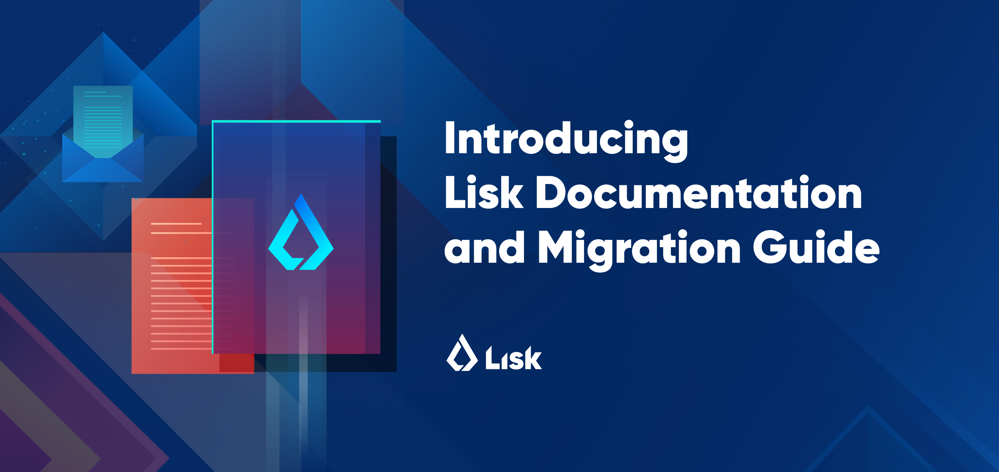

# Lisk Documentation

Welcome to the Lisk Documentation repository!

Get started with the tutorials and getting started guides:

- [Documentation Start](start/start.md)
- [Getting started: Build a blockchain application](start/build-blockchain-app.md)
- [Getting started: Interact with the network](start/interact-with-network.md)
- [Getting started: Maintain a node](start/maintain-node.md)
- [Tutorials](start/tutorials.md)
- [Custom transactions](start/custom-transactions.md)

See the documentation for each product:

- [Lisk SDK](lisk-sdk/introduction.md)
- [Lisk SDK](lisk-sdk/introduction.md) > [Lisk Framework](lisk-sdk/lisk-framework/introduction.md) 
- [Lisk SDK](lisk-sdk/introduction.md) > [Lisk Elements](lisk-sdk/lisk-elements/introduction.md)   
- [Lisk SDK](lisk-sdk/introduction.md) > [Lisk Commander](lisk-sdk/lisk-commander/introduction.md) 
- [Lisk Core](lisk-core/introduction.md)                    

## View previous versions of the documentation

The versions of the documentation are listed under [Releases](https://github.com/LiskHQ/lisk-docs/releases) and are tagged by release date in the following format:

```
lisk-docs-yyyy-mm-dd
```

Additionally, each product's documentation has its own release tags, referring to the product's versioning scheme.
This makes it convenient to find the corresponding documentation version for a specific version of the product.

Examples:

```
core-1.3.0
elements-2.1.0
commander-2.0.0
```

## Contribute to Lisk Documentation

There are several ways to help improve the documentation:

- [Create issues](https://github.com/LiskHQ/lisk-docs/issues): If mistakes are spotted, or you miss certain information.
- [Commit Pull Requests](https://github.com/LiskHQ/lisk-docs/pulls): Before committing any PRs, please have a look at our [Contribution Guidelines](CONTRIBUTING.md).
- [Give Feedback on Lisk.chat](https://lisk.chat/channel/network): We will read it. Just ping `@tschakki` in your message.
