# Lisk Hub Documentation

Lisk Hub is an all-in-one solution to manage your Lisk ID, access and send LSK tokens, as well as vote for delegates. It combines functionality from the former wallet and blockchain explorer. In the future, Lisk Hub will feature a DEX (decentralized exchange), Sidechain's registration and the ability to launch your own ICO.

## Table of contents

- [Download](#download)
- [Upgrade](#upgrade)
- [Pages](#pages)
  - [Welcome](#welcome)
  - [Create Account](#create-account)
  - [Login](#login)
    - [With Hardware Wallet](#with-hardware-wallet)
  - [Dashboard](#dashboard)
  - [Wallet](#wallet)
    - [Send Transaction](#send-transaction)
    - [Request LSK](#request-lsk)
  - [Delegates](#delegates)
  - [Settings](#settings)
    - [Second passphrase](#second-passphrase)
    - [Auto-logout](#auto-logout)
    - [Network switcher](#network-switcher)
    - [Local currencies](#local-currencies)
- [Features](#features)
  - [Lisk URLs](#lisk-urls)
  - [Search](#search)
    - [Lisk Address](#lisk-address)
    - [Delegate](#delegate)
    - [Transaction](#transaction)
  - [Bookmarks](#bookmarks)
  - [Sign message](#sign-messages)
- [Contribute to the Codebase](#contribute-to-the-codebase)

## Download

To download Lisk Hub, you can either go to [Lisk Products](https://lisk.io/products) and download Lisk Hub there, or you can go directly to [Lisk Hub Releases](https://github.com/LiskHQ/lisk-hub/releases) to pull the desired release from our GitHub repository.

## Upgrade

### Automatic notification

Lisk Hub has a built-in notification system to alert you when a new version is available:

### Checking for updates

In case you dismissed the upgrade, you can double-check by going to `Help` > `Check for updates...` in the menu:

## Pages

### Welcome

The Welcome page is the first page that shows up when starting Lisk Hub.
Without login, the user will have limited access to Lisk Hub.
The following features are available without login:

- [Create an account](#create-account)
- [Settings](#settings)
- [Dashboard](#dashboard)
- [Search](#search)

### Create Account

The most convenient way to create your Lisk ID within a few seconds.
On the Welcome screen of Lisk Hub, hit "Create an Account".

After a few clicks, the account creation is completed.

> **Important:** Make sure to keep your secret passphrase safe, that is generated during account creation.
> The secret passphrase will be the only way to access your wallet.

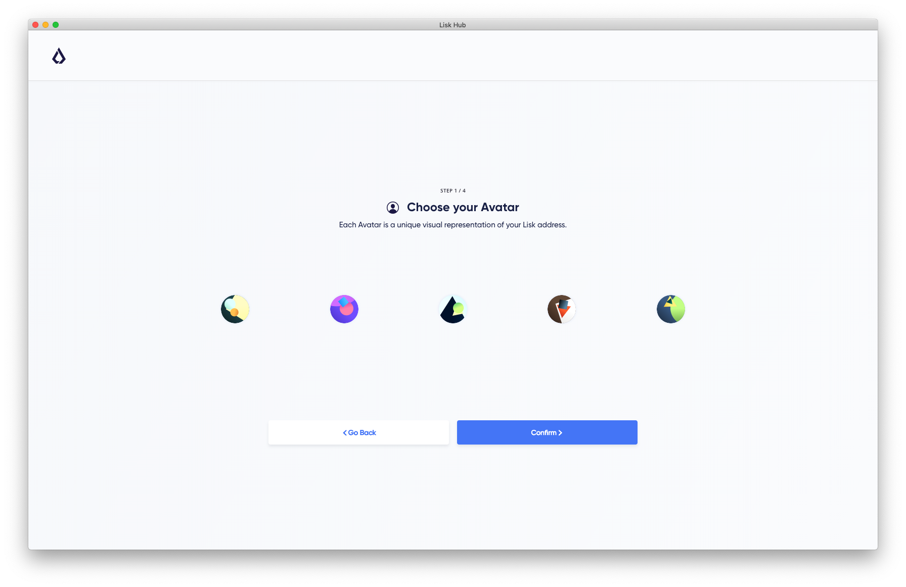

### Login

#### With passphrase

All you need to access your Wallet is the passphrase of your Lisk account.

The passphrase is the 12-word mnemonic, that was created during the [account creation](#create-account).

####  With Hardware wallet

Lisk Hub supports [Ledger Nano](https://www.ledger.com/) hardware wallets.
Support for more hardware wallet models is planned to add in future versions.

Steps to connect your Ledger Nano with Lisk Hub:

1. Connect your Ledger Nano with the computer and log in by entering your secret PIN on the Ledger Nano.
2. Install the Lisk app on your Ledger Nano via [Ledger Live](https://www.ledger.com/pages/ledger-live).
3. Open the Lisk Hub sign-in page.
It should recognize your connected Ledger Nano, and offer an additional login method "Hardware login".
4. Open the Lisk app on the Ledger Nano.
5. Click on the link named after your Ledger device after "Hardware login".
6. Pick your account on the "Accounts on Ledger" page.

The login page with recognized hardware wallet device.

If you see this page, Lisk Hub is successfully connected to your Ledger device.

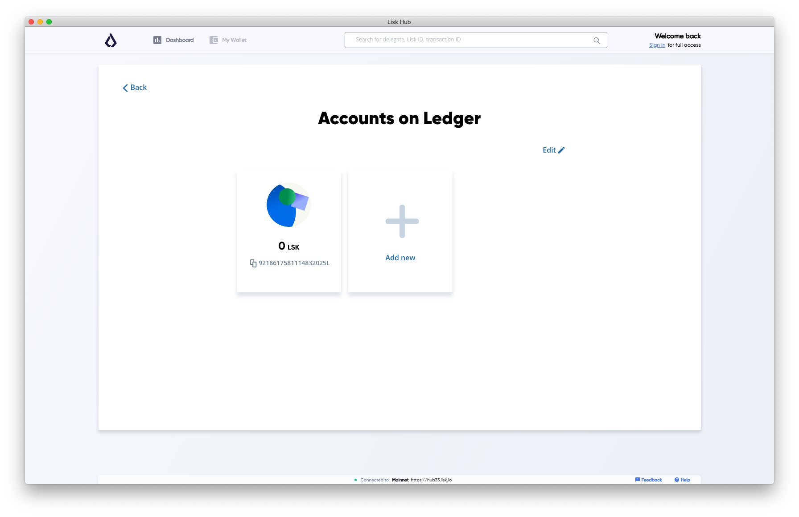

### Dashboard

The Dashboard provides an overview of the recent transaction, market price changes, and recent social media updates of Lisk.

It also provides a list of all added [Booksmarks](#bookmarks) and the option to add new ones.

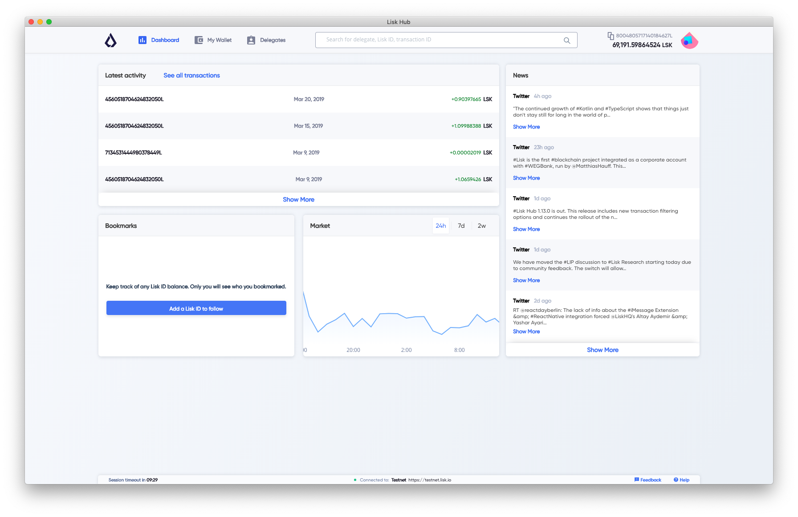

### Wallet

The Wallet page "My Wallet" displays a general overview of the account, like the transaction history and the current balance of one's personal account.

The user may filter the transactions to find or compare specific transactions quickly.

Available filters:

- filter transactions by date
- filter transactions by amount
- filter transaction by message

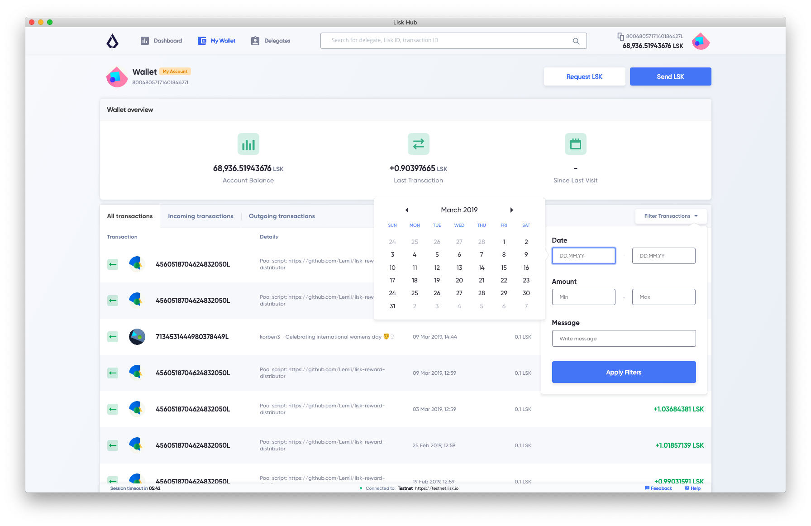

#### Send transaction

Send transactions with Lisk Hub by navigating to the "Wallet" page and hit the "Send" button.
On the next page, it is needed to specify the recipient address and the amount of LSK that should be sent.
The Reference is an optional data string, that will be connected to the transaction.
It can be a custom string of 64 bytes and is often used as a reference, what the transaction is about.

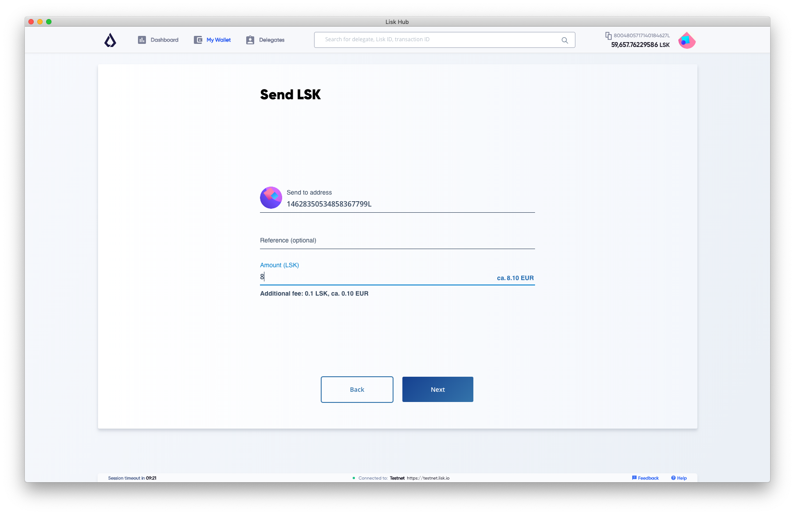

#### Request LSK

LSK can be requested from the "Wallet" page of Lisk Hub. Hit the "request" button on the upper right corner.
Lisk Hub offers different ways to request LSK from people:
 
 - request LSK via email
 - request LSK via QR-Code
 - request LSK via Lisk URL *(described below)*

By clicking on "Request specific amount" button, Lisk Hub will help you to create a link with the recipient(in that case your Lisk ID) and the amount of LSK, you want to receive.
Then post it to the person you want to receive LSK from.
By clicking on the link, Lisk Hub will open (if installed on the system) and prefill amount, recipient and reference for the user, so he/she only needs to hit the send button to send the tokens.

*Lisk URL example:* `lisk://wallet/send?recipient=8004805717140184627L&amount=8&reference=for being awesome`

Opens the wallet and prefills the send form with recipient and amount.
We use `14628350534858367799L` for the address and `8` LSK for the amount.

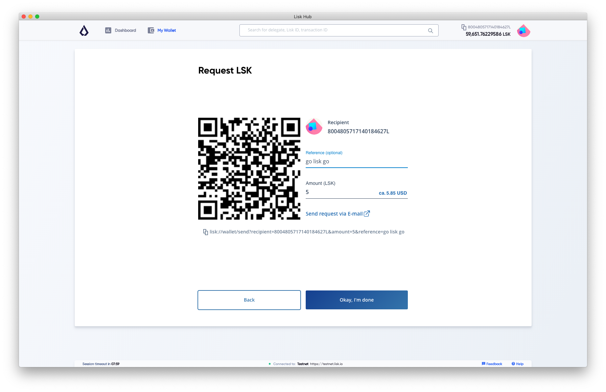

### Delegates

Provides a GUI to conveniently manage the votes of one's account.
As an example, we want to vote for `samuray` and `slasheks` and unvote `vipertkd`.

*Lisk URL:* `lisk://delegates/vote?votes=samuray,slasheks&unvotes=vipertkd` 

This will open the Lisk app and automatically select the delegates `samuray` and ` slasheks` for upvoting and `vipertkd` for unvoting.

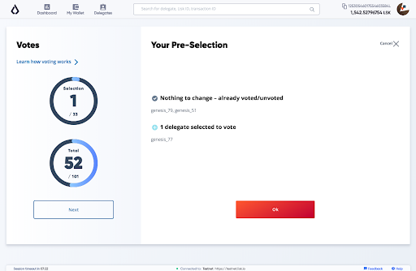

The below screenshot displays how it looks if the votes are set manually inside the GUI.

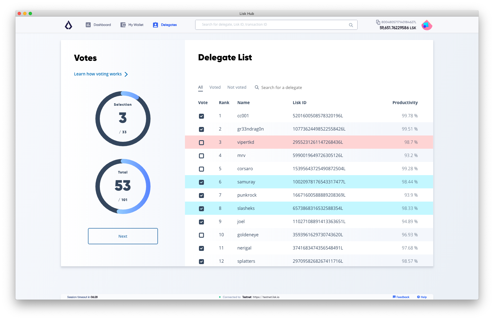

### Settings

List of Settings:

- Security: Security relevant features of Lisk Hub.
  - [Second Passphrase](#second-passphrase)
  - [Auto logout](#auto-logout)
- Advanced features: General Settings.
  - [Network switcher](#network-switcher)
  - Delegate features: Enables voting for delegates features on Lisk Hub.
  - Send anonymous statistics: Share anonymous usage statistics with Lisk Hub.
- Local: Settings for customizing Lisk Hub appearance.
  - [Local currencies](#local-currencies)

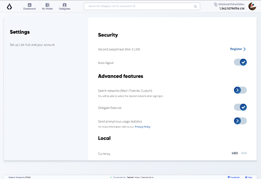

#### Second passphrase

You can register for a `second passphrase` for a fee 5 LSK via the [Settings](#settings) page.

The second passphrase will be prompted each time the account performs important actions, like sending transactions or voting.

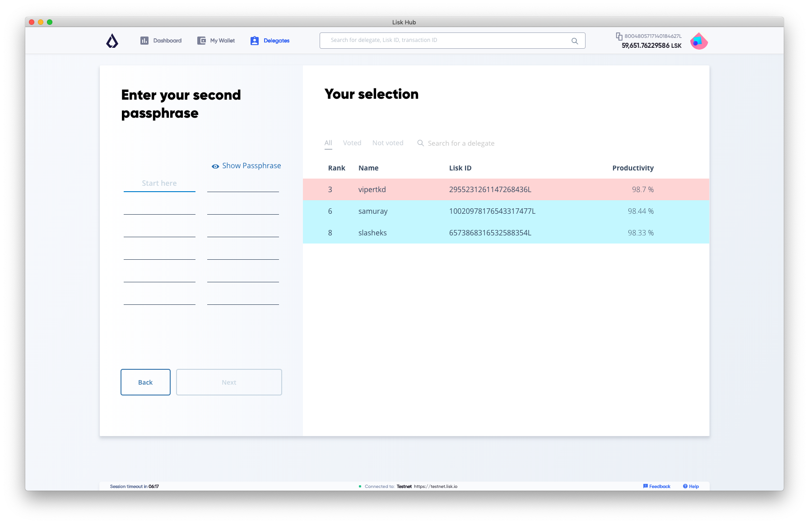

#### Auto-logout

Auto-logout is a security feature that logs the user out after 10 minutes automatically.
The user may reset the timer manually to prevent auto-logout from happening.

It is possible to turn it off completely on the Settings page.

> Turning it off temporarily can make sense, e.g. during the voting process, as it may log you off in the middle of it if you spend more than 10 minutes on the selection page.
> In that case, don't forget to turn it back on after the voting process.

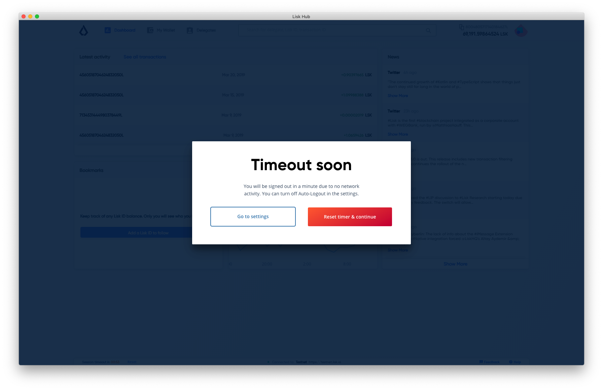

#### Network switcher

> The default network Lisk Hub will try to connect to is the Lisk Mainnet.
> The network switcher on the login page is not visible by default but can be enabled from the settings page or through Lisk URL.

*Lisk URL:* `lisk://login?showNetwork=true`

Opens the login page and enables the network switcher options.
A new option will appear on the login screen, that allows the user to change the network, or to specify a concrete custom Node, Lisk Hub should connect to.

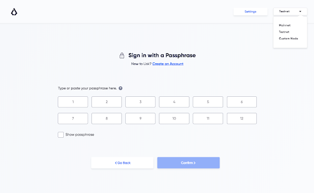

#### Local Currencies

On the "Settings" page, you can select your preferred currency conversion.

Currently supported:
- $ (USD)
- € (EUR)

## Features

### Lisk URLs

After installing Lisk Hub on your device you will be able to use the `lisk` protocol. Example: `lisk://wallet`.
Everything that comes after `lisk://` is treated as a route so this example will open the Lisk Hub app on the wallet page.

> When clicking on a Lisk URL, the system opens Lisk Hub (if it is installed) directly on the desired page. It can prefill certain fields or enable certain features in Lisk Hub on the fly.

### Search

Inside the navigation bar at the top, one can find the Search field.
Here the user may search for the following:

#### Lisk Address

Search for other Lisk addresses and view their account data.

The transaction history provides a chronological overview of all transactions associated with this account on the Lisk blockchain.

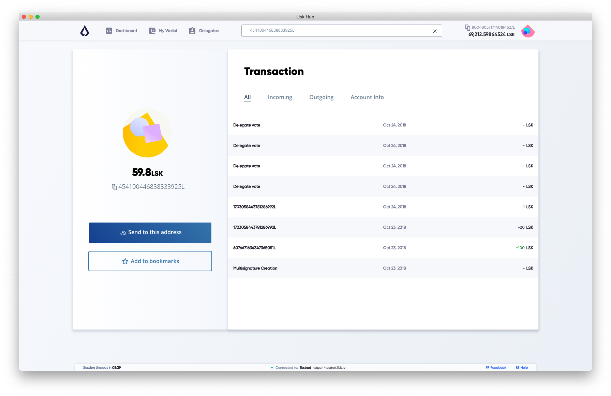

The "Account Info" page displays general information, like the casted votes of an account.

#### Delegate

Search for a registered delegate name to view the respective delegate profile page.

Instead of the tab "Account Info", a registered Delegates account page will contain the tab "Delegate statistics".

Here one can find the following information about a delegate:

- Rank: The rank of the delegate depends on the voteweight compared to other delegates in the network.
- Uptime: Productivity of the delegate's node.
- Approval: The Approval is displayed in percent(%) and depends on the vote weight compared to other delegates in the network.
- Vote weight: Total sum of the current account balances of all the accounts that have voted for this delegate.
- Amount of LSK forged: Amount of LSK the delegate earned from block rewards when forging a new block to the blockchain.
- Amount forged blocks: Total amount of forged blocks by this delegate.
- Who voted for this delegate: List of Lisk addresses, who votes for this delegate.
- Which delegates the delegate account voted for: List of delegates this delegates is voting for.

#### Transaction
 
Search for a specific transaction and its details by its ID.

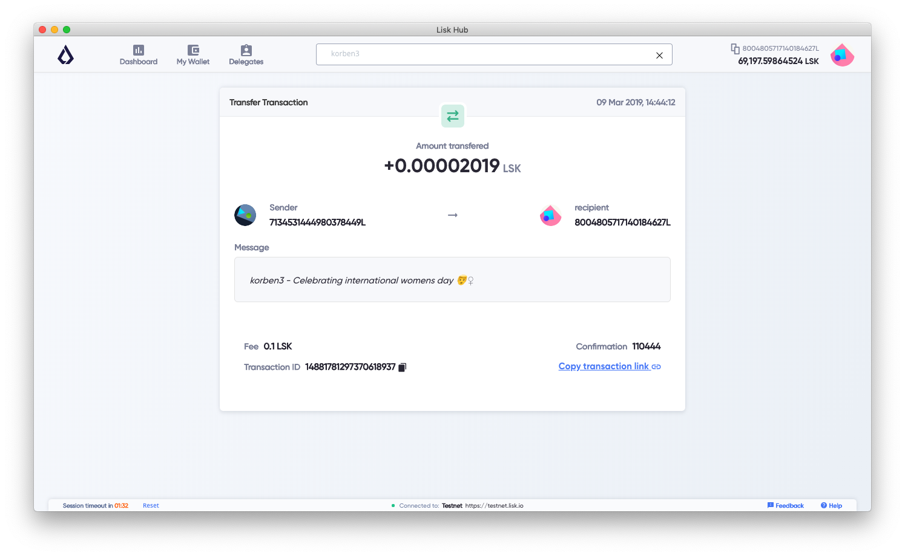

### Bookmarks

Lisk Hub supports to create Bookmarks of accounts. Bookmarks work basically like an address book.
The user can save his*her favorite Lisk addresses with name, what makes finding and recognizing addresses much more simple.

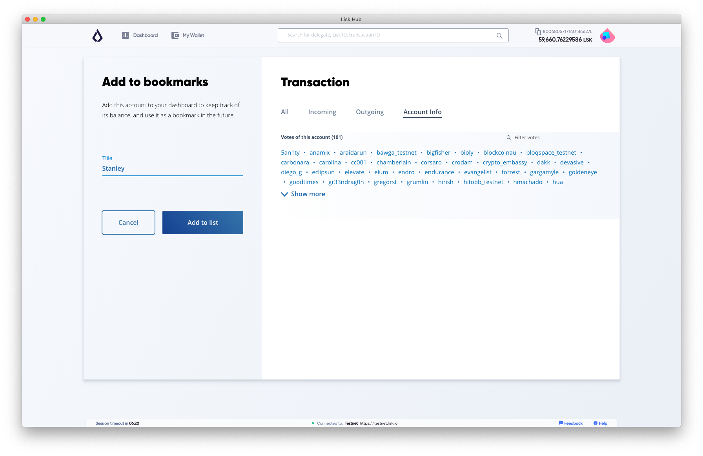

When sending LSK with Lisk Hub, the user may choose conveniently among the already created bookmarks.

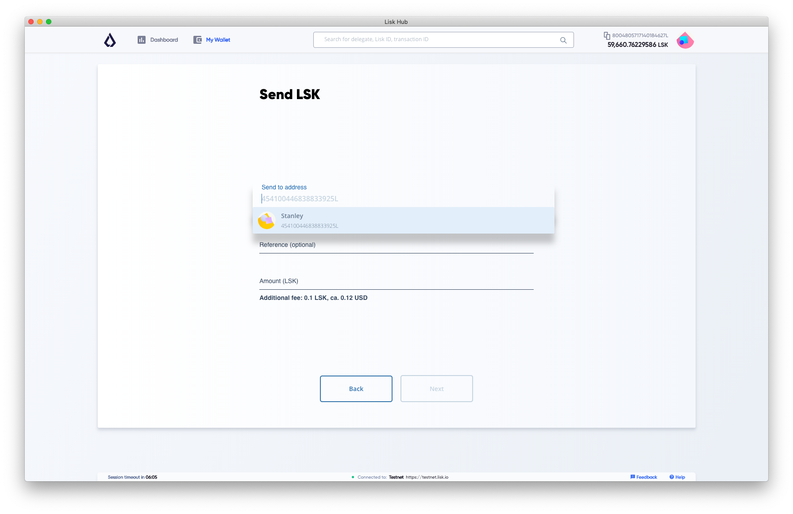

### Sign message

> This feature is not accessible through the GUI (graphical user interface) of Lisk Hub.
> To sign a message, use the Lisk URL below. 

Opens the sign message form and prefills it with your message.
As an example we use `i love lisk hub`.

*Lisk URL example:* `lisk://sign-message?message=i love lisk hub`

The signed message will look like this:

## Contribute to the Codebase

Everyone is invited to contribute to the Lisk Hub project. We welcome and appreciate all contributions. 

### Github
All necessary information can be found on our [Lisk Hub Github](https://github.com/LiskHQ/lisk-hub).

### Contribution Guidelines
Please be sure to read and follow our [Contribution Guidelines](https://github.com/LiskHQ/lisk-hub/blob/development/docs/CONTRIBUTING_GUIDE.md).

### Gitter
If you have any further questions please join our [Gitter](https://gitter.im/LiskHQ/lisk).
