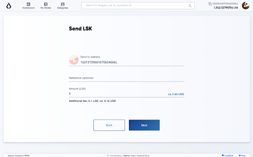
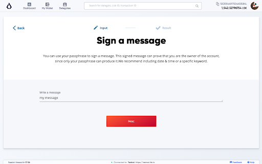

# Lisk Hub Documentation

Lisk Hub is an all-in-one solution to manage your Lisk ID, access and send LSK tokens, as well as vote for delegates. It combines functionality from the former wallet and blockchain explorer. In the future, Lisk Hub will feature a DEX (decentralised exchange), Sidechain's registration and the ability to launch your own ICO.

## Table of contents

- [Download](#download)
- [Upgrade](#upgrade)
- [Features](#features)
  - [Lisk URLs](#lisk-urls)
  - [Network switcher](#network-switcher)
  - [Send transaction](#send-transaction)
  - [Sign message](#sign-messages)
  - [Voting](#voting)
  - [Hardware wallet support](#hardware-wallet-support)
  - [Second passphrase](#second-passphrase)
  - [Auto-logout](#auto-logout)
  - [Local currencies](#local-currencies)

## Download

In order to download Lisk Hub, you can either go to [Lisk Products](https://lisk.io/products) and download Lisk Hub there, or you can go directly to [Lisk Hub Releases](https://github.com/LiskHQ/lisk-hub/releases) to pull the desired release from our GitHub repository.

## Upgrade

### Automatic notification

Lisk Hub has a built in notification system to alert you when a new version is available:

### Checking for updates

In case you dismissed the upgrade, you can double-check by going to `Help` > `Check for updates...` in the menu:

## Features

### Lisk URLs

After installing Lisk Hub on your device you will be able to use the `lisk` protocol. Example: `lisk://wallet`.
Everything that comes after `lisk://` is treated as a route so this example will open the Lisk Hub app on the wallet page.

> When clicking on a Lisk URL, the system opens Lisk Hub (if it is installed) directly on a desired page. It can prefill certain fields or enable certain features in Lisk Hub on the fly.

### Network switcher

> The default network Lisk Hub will try to connect to is the Lisk Mainnet.
> The network switcher on the login page is not visible by default, but can be enabled from the settings page or alternatively through Lisk URL.

*Lisk URL:* `lisk://add-account?showNetwork=true`
Opens the login page and enables the network switcher options.
A new option will appear on the login screen, that allows the user change the network, or to specify a concrete custom Node, Lisk Hub should connect to.

### Send transaction

Send transactions with Lisk Hub by navigating to the "Wallet" page and hit the "Send" button.
On the next page, it is needed to specify the recepient address and the amount of LSK that should be send.
The Reference is an optional data string, that will be connected to the transaction.
It can be a custom string of 64 bytes and is often used as reference, what the transaction is about.

*Lisk URL:* `lisk://wallet?recipient=16313739661670634666L&amount=5`
Opens the wallet and prefills the send form with recipient and amount.
We use `16313739661670634666L` for the address and `5` LSK for the amount.

### Sign message

> This feature is not accessible through the GUI (graphical user interface) of Lisk Hub.
> To sign a message, use the Lisk URL below. 

Opens the sign message form and prefills it with your message.
As an example we use `my message`.

*Lisk URL:* `lisk://sign-message?message=my message`

### Voting

Makes voting for delegates easier. 
As example, we want to vote for `genesis_77` and `genesis_79` and unvote `genesis_51`.

*Lisk URL:* `lisk://delegates/vote?votes=genesis_77,genesis_79&unvotes=genesis_51` 

This will open the Lisk app and automatically select the delegates `genesis_77` and ` genesis_79` for upvoting and `genesis_51` for unvoting.

The below screenshot displays how it looks, if the votes are set manually inside the GUI.

### Hardware wallet support

Lisk Hub supports Ledger Nano hardware wallets.

### Second passphrase

On the settings page you can register for a `second passphrase` for a fee 5 LSK  and turn off the `auto-lock`, which would usually log you out of your account after 10 minutes.

### Auto-logout

Auto-logout is a security feature that automatically logs out, if the User has not performed any actions inside of Lisk hub during that time.

It is possible to turn it off on the Settings page.

> Turning it off temporarily can make sense, e.g. during voting process, as it may log you off in the middle of it, if you spend more than 10 minutes on the selection page.
> In that case, dont forget to turn it back on after the voting process.

### Local Currencies

On the "Settings" page, you can select your preferred currency conversion.

Currently supported:
- Dollar
- Euro
