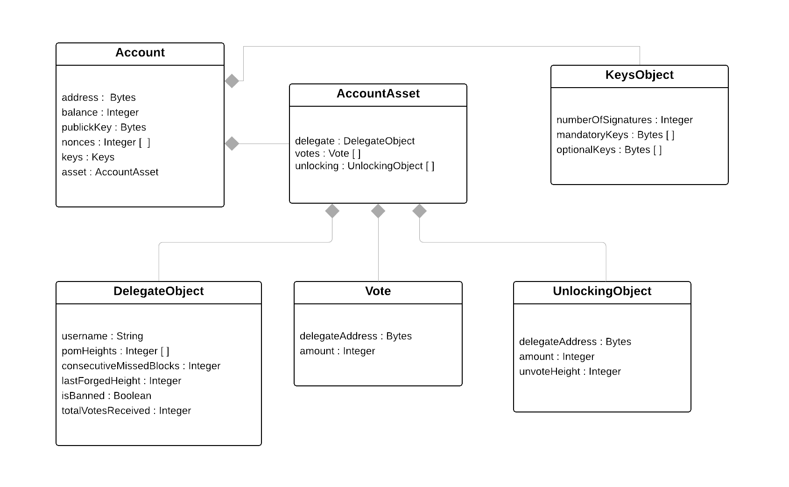

= Accounts

A Lisk account consists of a unique identifier called address, an amount of tokens referred to as balance, and possibly some additional properties used in other parts of the Lisk protocol.

The account state is not stored as part of the blockchain, however it can be computed by executing all transactions contained in previous blocks. Verification of the validity of a transaction requires the state of the referenced accounts.

== Account Properties

This section lists the properties stored in a Lisk account.

// image::../assets/images/InfographicsV1/Infographic1.png[accountJSON2]

=== `address`

The address is the main identifier of the account. It is used, for example, to identify the recipient when transferring balance between users. The address is calculated as the first 20 bytes of the SHA-256 of the public key.

For the front end, a link:6-appendix.adoc#user-friendly-address[user-friendly address format] is provided, whereby each address starts with the prefix “_lsk_" and a checksum is appended to signal accidental typing mistakes.

=== `balance`

The balance is an integer value indicating how many tokens are stored in the account and available to be used. The total number of tokens owned by an account is the sum of the balance and the tokens locked into <<votes,`votes`>> and <<unlocking,`unlocking`>>.
Balance can be sent from one account to another using a link:2-transactions.adoc#balance-transfer[Balance Transfer Transaction].

=== `publicKey`

The public key is used to verify the validity of signatures created by the account using its corresponding private key. Furthermore, the <<address,address is generated from the public key>>.
The public key is set only when the first transaction originating from the account is included into the blockchain.

=== `keys`

By default, a transaction issued by an account has to be signed with the private key corresponding to the original public key that generated the account address.
However, this default configuration can be changed, and issuing a transaction can require signatures by multiple different private keys (and not necessarily the default one).
The corresponding public keys are stored in the `keys` property.
These public keys can be either [#index-mandatory-1]#mandatory# or [#index-optional-1]#optional#: All mandatory keys have to sign the transaction, and the total number of signatures (mandatory plus optional) has to be equal to `numberOfSignatures` (also stored in `keys`).
Users can update the `keys` property with a link:2-transactions.adoc#multisignature[Multisignature Registration Transaction], specifying the mandatory and optional keys and the number of required signatures.

=== `nonces`

All transactions sent from one account must contain distinct link:2-transactions.adoc#nonce[*nonce*] values.
This allows signing and sending multiple transactions with the same asset using different nonces, while at the same time preventing transaction replay.
All nonces previously used by an account are stored in this property.

=== `asset`

The account asset contains all extra information that is specific to a transaction or to the blockchain the account belongs to.

The following properties are part of an account asset in the default Lisk protocol.

==== `delegate`

Accounts registered as delegates store extra information related to link:3-blocks.adoc#block-forgers[block forging] in this property, such as the delegate's username or the number of consecutive missed blocks.

==== `votes`

In link:4-consensus-algorithm.adoc#lisk-delegated-proof-of-stake[Lisk delegated Proof-of-Stake], users link:2-transactions.adoc#vote[vote] for accounts that are registered as delegate accounts.
Votes issued by a user are stored in their account as a list of tuples, each with the voted-delegate address and the amount of voted tokens (in Beddows).
Tokens used for voting are [#index-locked-1]#locked#, and cannot be used (or moved from the account) before they have been [#index-unlocked-1]#unlocked#.

==== `unlocking`

Tokens used to vote for a delegate are frozen, and have to be unlocked to make them available again. Similarly to the `votes` property, this property stores the voted-delegate's address and the amount, but also the block in which the votes have been removed from the delegate.
After the appropriate waiting time, the user can then unlock the tokens with an link:2-transactions.adoc#unlock-vote[Unlock Transaction].
