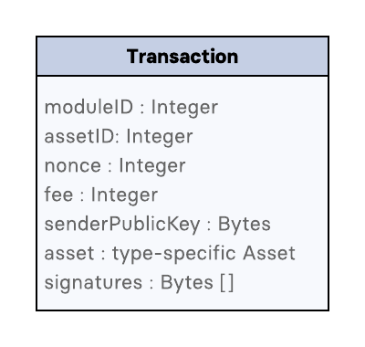
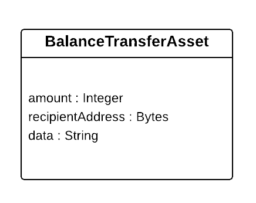
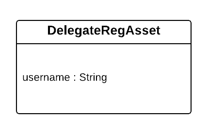
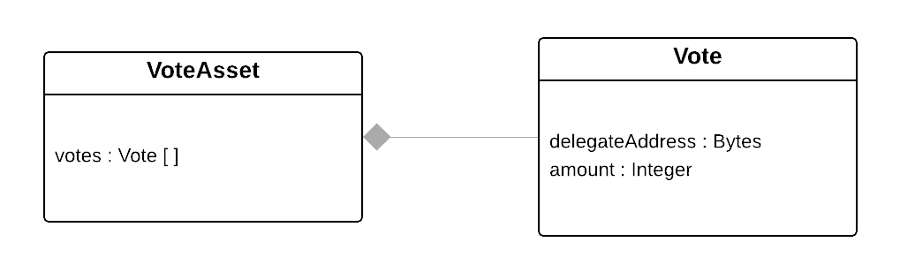
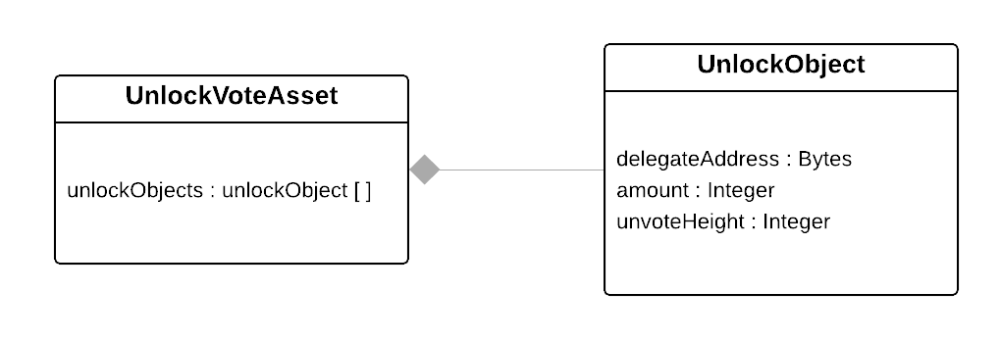
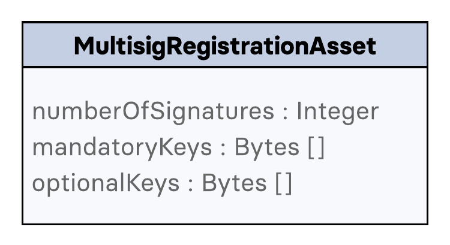
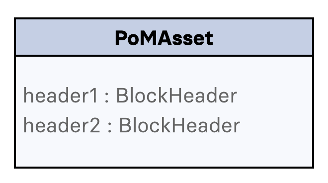

= Transactions

In Lisk, the state of accounts is updated by transactions included in a link:3-blocks.adoc[block]. Every account can issue a transaction, with the corresponding signature and data. There is a set of different transaction types and each of these types defines a specific logic for modifying accounts depending on the transaction data. In the table below, a summary of these transaction types and the purpose each of them serve is shown.

|===
|*Transaction Type*|*Purpose*

|*Balance Transfer*|Transmit funds to another Lisk account
|*Delegate Registration*|Register a delegate for the account
|*Vote*|Submit or remove vote(s) for delegates
|*Unlock Vote*|Unlock locked tokens
|*Multisignature*|Register a multisignature in the account
|*PoM*|Submit a Proof-of-Misbehavior of a delegate
|===

== Transaction Properties

Every transaction object in the Lisk protocol, regardless of the type, has a common set of properties. These properties are shown in the subsection below.

=== `type`

An integer identifying the type of the transaction.

=== `nonce`

An integer that accounts for the number of transactions from the sender account.
For a transaction to be valid, this integer has to be equal to the `nonce` stored in the sender account.
If due to network congestion, a transaction was not included in a block because its fee was too low, a user can broadcast a new transaction using the same `nonce` value but with a higher fee.
Once one of the two transactions is included in the blockchain, the other one becomes invalid as the `nonce` has already been used.

=== `fee`

The fee to be spent by the transaction. This fee has to be equal or greater than a minimum value for the transaction to be valid. The minimum value is calculated as the size of the transaction object multiplied by a constant, `minFeePerByte`, given by the protocol. The value of `minFeePerByte` is 1000 (10^-5^ LSK/byte in Lisk Mainnet). Note that for *Delegate Registration* transactions there is an extra summand of 10^9^ (10 LSK in Lisk Mainnet) added to the minimum fee to account for the name space used by this type of transaction.

For example, in Lisk Mainnet, for a <<Balance Transfer>> transaction with a size of 133 bytes, the minimum fee is 10^-5^ LSK/byte × 133 bytes = 0.00133 LSK. In the case of <<Delegate Registration>> transaction with a size of 124 bytes, the minimum fee of the transaction is 10 LSK + 10^-5^ LSK/byte × 124 bytes = 10.00124 LSK.

This required minimum fee paid by every transaction is burned, in other words, it is not assigned to any account balance. The remaining fee on top of this is assigned to the delegate forging the block in which the transaction is included. This implies that under normal circumstances delegates give priority to transactions with higher remaining fees.

=== `senderPublicKey`

The public key of the account issuing the transaction. Note that this public key does not necessarily sign the transaction. For simplicity, the account issuing the transaction is called the sender account in this document.

=== `asset`

This property contains the data specific to the type of the transaction. For each `type` value, there exist a unique `asset` property. The section <<Transaction Types>> describes the different transaction types with respect to the `asset` property of each of them.

=== `signatures`

An array with the signatures of the transaction. If the account associated to `senderPublicKey` does not have the link:1-accounts.adoc#keys[`keys`] property, the object containing the five properties, `type`, `nonce`, `fee`, `senderPublicKey`, and `asset`, has to be signed by the private key corresponding to the `senderPublicKey`. Otherwise, the signing process has to be repeated for each of the private keys associated with an applicable set of public keys specified in  the `keys` property of the account. In the link:7-appendix.adoc#signature-scheme[Appendix] section more details about the signing process are given.

== Transaction ID

In Lisk, every transaction is associated with a transaction ID, which uniquely identifies a transaction in the blockchain. The transaction ID is the SHA-256 hash of the serialized transaction.

== Minimum Balance

A <<Balance Transfer>> transaction must make the balance of the receiving account equal to or greater than 5 × 10^6^ (0.05 LSK in Lisk Mainnet). Subsequently, any transaction sent from an account is only valid if the resulting balance of the sender account is at least 5 × 10^6^. This constraint exists to account for the cost of creating and storing accounts in Lisk.

== Transaction Types

The 6 transactions types available in the Lisk protocol are listed in the table displayed above. Each one induces a concrete operation on accounts and is defined by a unique schema and transaction logic. The type-specific data is given in the `asset` property previously mentioned. The key points and useful information for each of these transactions are commented in the following subsections.

=== Balance Transfer

This transaction type transfers the amount of tokens specified in the `amount` property from the link:1-accounts.adoc[account] corresponding to the `senderPublicKey`, i.e. the sender account, to the account specified in `recipientAddress`. This transaction offers the possibility to send a message in the optional property `data`.

=== Delegate Registration

This transaction registers the sender account as a link:4-consensus-algorithm.adoc#delegates-voting-and-delegate-weight[delegate] with the name given in `username`.

=== Vote

This transaction submits the votes specified in `votes` from the sender account. This is accomplished by specifying the Lisk link:1-accounts.adoc#address[address] of the voted delegate in `delegateAddress` together with the amount of support given to this delegate in `amount`. The quantity given in `amount` is subsequently [#index-locked-2]#*locked*# and cannot be used for other transactions. If the amount is negative, it implies that the specified amount of votes are removed from the delegate. The maximum number of votes that can be cast in a single transaction is 20 and `amount` has to be a multiple of 10^9^ (10 LSK in Lisk Mainnet).

=== Unlock Vote

This transaction [#index-unlocked-2]#*unlocks*# the tokens specified in `amount` that were previously unvoted for the delegate specified by `delegateAddress` by a vote transaction at the height given in the property `unvoteHeight`. This transaction is only valid if it is issued after the unlocking period has been completed since `unvoteHeight`. For a regular vote the unlocking period is 2000 blocks (around 5 hours). For self-votes, i.e. if the `delegateAddress` property of the transaction is equal to the account link:1-accounts.adoc#address[address], this period is 260,000 blocks (around 30 days).

=== Multisignature Registration

This transaction registers the sender account as a multisignature account. The set of [#index-mandatory-2]#*mandatory*# keys needs to be specified in `mandatoryKeys` whereas the set of [#index-optional-2]#*optional*# keys have to be specified in `optionalKeys`. The total number of keys required for every future outgoing transaction from the account is given in `numberOfSignatures`. Once this transaction is included in a block, every transaction from this account has to be signed by an applicable set of private keys.

=== PoM

This transaction submits a proof of misbehaviour of a certain delegate. It contains the information necessary to prove that the delegate who signed the link:3-blocks.adoc#block-header[block headers] given in `header1` and `header2` has violated the link:4-consensus-algorithm.adoc#lisk-bft[Lisk-BFT protocol]. The link:4-consensus-algorithm.adoc#punishment-of-lisk-bft-protocol-violations[Punishment of Lisk-BFT Protocol Violations] section provides the details regarding implications of this transaction type.

