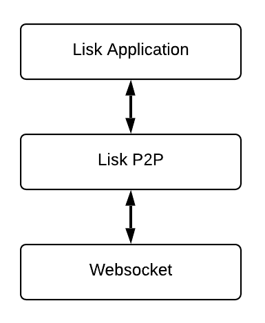

= Network

Lisk nodes connect to each other in a random manner, thereby forming an unstructured P2P network where information is exchanged using a gossip-based protocol.
In this way nodes can synchronize their local copies of the blockchain, by broadcasting blocks and new transactions to be stored in the transaction pool.

== Lisk P2P Architecture

Connections in the https://github.com/LiskHQ/lips/blob/master/proposals/lip-0004.md[*Lisk P2P]* are established as _websockets_ (see https://en.wikipedia.org/wiki/WebSocket[Wikipedia page]) using the https://socketcluster.io/#!/[_SocketCluster_] framework.
Each node retains a list of known peers and their IP addresses and initializes up to 20 outgoing connections to randomly selected peers, while accepting up to 100 incoming connections.

When an outgoing connection is dropped, the node starts a new connection with another peer.
Furthermore, to keep the network dynamic, approximately every 5 minutes one outgoing connection is dropped and replaced with a new one.

The _Lisk RPC and Events_ layer lies on top of SocketCluster.
This layer manages interactions between nodes using Remote Procedural Calls (see https://en.wikipedia.org/wiki/Remote_procedure_call[Wikipedia page]).

Finally, the _Lisk application_ layer provides a high level interface to interact with the blockchain.

== Block Propagation

Nodes propagate newly received blocks in order to keep the network synchronized and to achieve link:4-consensus-algorithm.adoc[consensus].
When a new block is received, it is first validated.
If it is valid and it has not been forwarded before, the full block is sent to 16 randomly chosen peers.
Furthermore, nodes announce that a new block has been received by sending part of the block header to the rest of the connected peers, which can request the full block in case it has not been received yet.

== Transaction Propagation

Transactions are propagated through the network in a similar manner to blocks.
Every 5 seconds, a bundle of 25 link:2-transactions.adoc#id[transaction IDs] are selected from the transaction pool and sent to all connected peers.
The peers then check if they already have the corresponding transactions and can request any that are missing from the node and include them in their transaction pool.

== Transaction Pool

The transaction pool collects transactions that are waiting to be included in a block.
When forging a new block, a delegate selects a set of transactions from the pool and includes them in the link:3-blocks.adoc#block-payload[block payload].
Conversely, when a new block is received, transactions included in the block are removed from the transaction pool.
