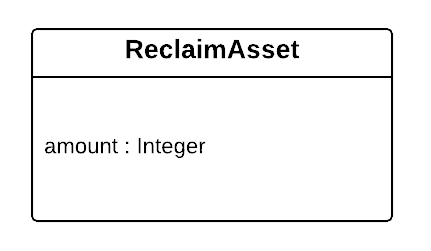

= Lisk Mainnet specifications

The Lisk Mainnet follows the Lisk protocol.
It has been lauched in May 2016 and has a few specificities that are not part of the basic Lisk protocol.

== Token

The native token for the Lisk Mainnet is the *LSK*. Each LSK is further subdivided into 10^8^ [#index-beddows-1]#*Beddows*#.

== Transactions

The Lisk Mainnet supports one additional transaction.

=== Reclaim

This transaction allows to access the balance that was sent to a legacy address without any associated public key.
Legacy addresses, generated from the first eight bytes of the public key, were used in older versions of the protocol.
This legacy address is deduced from the `senderPublicKey` of the transaction and the amount specified in the transaction asset must correspond to the amount in the legacy account.

== Network identifier

The network identifier of the Lisk Mainnet is `9ee11e9df416b18bf69dbd1a920442e08c6ca319e69926bc843a561782ca17ee`.
