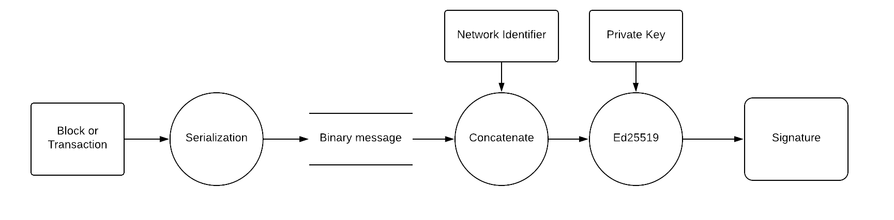
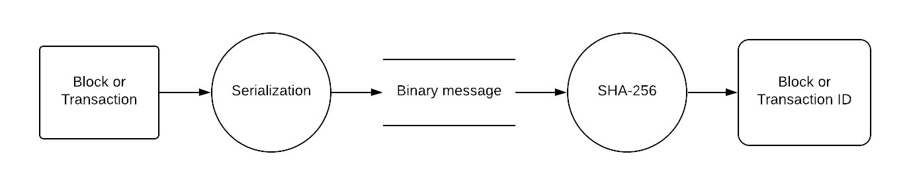
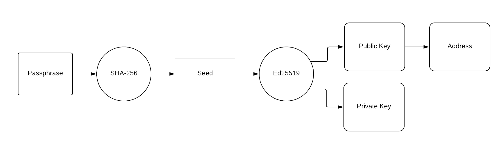

= Appendix
:description: The appendix section of the Lisk protocol contains additional information related to the Lisk protocol.
:imagesdir: ../assets/images
:page-no-next: true

:url_accounts: accounts.adoc
:url_transaction: transactions.adoc
:url_blocks: blocks.adoc
:url_consensus: consensus-algorithm.adoc
:url_network: network.adoc
:url_mainnet: mainnet.adoc
:url_appendix: appendix.adoc

== [#index-serialization-1]#Serialization#
The Lisk protocol specifies in https://github.com/LiskHQ/lips/blob/master/proposals/lip-0027.md[LIP 0027] how to serialize objects used by the protocol.
Generating a binary message from a JavaScript object is performed by following a stricter version of the https://developers.google.com/protocol-buffers/docs/encoding[Protocol Buffers] specification.
Objects to be encoded have their format specified in a JSON schema.
The schemas for transactions, blocks and accounts can be found in https://github.com/LiskHQ/lips/blob/master/proposals/lip-0028.md[LIP 0028], https://github.com/LiskHQ/lips/blob/master/proposals/lip-0029.md[LIP 0029] and https://github.com/LiskHQ/lips/blob/master/proposals/lip-0030.md[LIP 0030] respectively.

== Signature scheme
The Lisk protocol uses the Ed25519 signature scheme (see https://en.wikipedia.org/wiki/Digital_signature[Wikipedia page] and the specification page for https://ed25519.cr.yp.to/[Ed225519]).
The signing procedure uses the message and the private key of the signatory to generate 64 bytes, called the signature.
Other users can then verify this signature with respect to the message and the public key of the signatory.

In the Lisk protocol the procedure for signing blocks and transactions is as follows:

. Serialize the object into the corresponding binary message.
. Prepend the 32 bytes network identifier to the binary message (see https://github.com/LiskHQ/lips/blob/master/proposals/lip-0009.md#specification[LIP 0009] and https://github.com/LiskHQ/lips/blob/master/proposals/lip-0024.md#update-to-the-block-header-signing-procedure[LIP 0024]).
The network identifier  uniquely binds a transaction or a block to one network.
Different blockchains created with the Lisk SDK should use different network identifiers to avoid transaction replay between chains.
. Compute the signature of the output of step 2 above, as described in the Ed25519 specifications.

=== Verifying signatures
The network identifier is not transmitted with the binary message.
The procedure to verify transactions is therefore as follows:

. Remove the signature from the object received.
. Serialize the output of step 1 to a binary message.
. Prepend the network identifier to the binary message.
. Verify the output of step 3 with respect to the signature and the signer public key.

== Object ID
The Lisk ecosystem uses IDs to identify objects, such as blocks and transactions.
The ID is obtained by serializing the object, including the signature, and taking the SHA-256 hash (see https://en.wikipedia.org/wiki/SHA-2[Wikipedia page]) of this binary message.

== Address

=== Key pair and address creation
To create a new address, first a 12-word passphrase is generated following the specifications of https://github.com/bitcoin/bips/blob/master/bip-0039.mediawiki#generating-the-mnemonic[BIP39].
The passphrase is then hashed using SHA-256 into a 256-bit string. The resulting hash is used as the seed to generate the [#index-private_key-1]#*private key*# and the [#index-public_key-1]#*public key*# using Ed25519 signature scheme.
Finally, the [#index-address-1]#address# is generated by taking the first 20 bytes of the SHA-256 hash of the public key.

=== Base32 representation
We display addresses in a Base32 representation including a checksum and the "lsk" prefix.
The procedure to obtain the [#index-user_friendly_address-1]#*Base32 representation*# of the address is as follows:

. Calculate a 30-bit checksum of the 20-byte address of the account using a BCH code, see https://github.com/bitcoin/bips/blob/master/bip-0173.mediawiki[BIP173]. This step provides protection against accidentally typing mistakes.
. Concatenate the 20-byte address and the output of step 1.
. Encode the output of step 2 in a custom Base32 format. Lower-case letters and digits are used, the characters i, l, 1 and 0 are removed for usability reasons.
. Add the prefix "lsk" to the output of step 3. This ensures that the Base32 representation used in the Lisk wallet start with "lsk" and that the final address is 41 characters long.

As an example, the address `0xc247a42e09e6aafd818821f75b2f5b0de47c8235` has the Base32 representation `lsk24cd35u4jdq8szo3pnsqe5dsxwrnazyqqqg5eu`.

