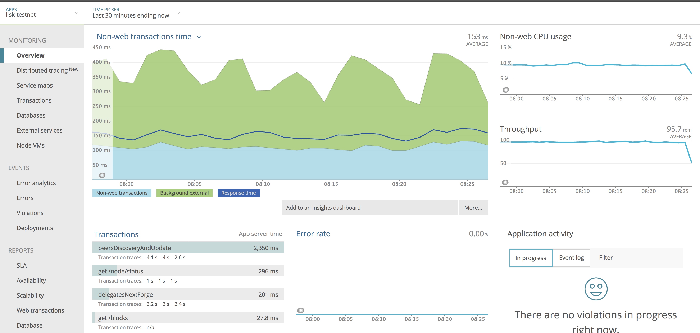

# Performance Monitoring

We use [New Relic](http://newrelic.com/) to monitor the activities inside of the application. It enables to have detailed insight
of the system and keep track of performance of each activity. E.g. an HTTP API call or a background job from queue.

Below are the steps you need to follow to get the statistics for New Relic:

1. [Enable New Relic](#enable-new-relic)
   1. [Get New Relic license key](#get-new-relic-license-key)
   2. [Add license key as evironment variable](#add-license-key-as-environment-variable)
   3. [Start Lisk Core node](#restart-lisk-core-node)
2. [Keep your node busy](#keep-your-node-busy)
   * [Option 1: Lisk Core Test Suite](#option-1-lisk-core-test-suite)
   * [Option 2: Use Apache Benchmark Tool](#option-2-use-apache-benchmark-tool)
   * [Option 3: Use Siege Tool](#option-3-use-siege-tool)
   * [Option 4: Write custom script](#option-4-write-custom-script)
3. [Analyse results](#analyse-results)

## Enable New Relic

### Get New Relic license key

First thing you need to do is registering an account at https://rpm.newrelic.com, if you have not already done that.
After successful login, select "Account settings" in the account dropdown in the New Relic UI.
From the Account information section on the right side of the Summary page, copy your license key.

### Add license key as environment variable

To enable the performance monitoring on your node make sure you have an environment variable `NEW_RELIC_LICENSE_KEY`
available and set:

```bash
export NEW_RELIC_LICENSE_KEY={your-personal-license-key}
```

### (Re)start Lisk Core node

Then start the node normally, or restart if it is already running.

```bash
bash lisk.sh start # start lisk core binary
pm2 start lisk # start lisk core source
docker start container_id # start lisk core docker
```

## Keep your node busy

As second step, keep your node busy by running various API request against it.
There are several ways to create workload on your node:

### Option 1: Lisk Core Test Suite

Info | Note 
--- | --- 
 | The Lisk Core Test Suite is only available for Lisk Core from Source.

Info | Note 
--- | --- 
 | The `unit` Testsuite is not suited for this purpose, as unit tests are not executed in the context of the running application.

Tests are run using the following command:

```bash
npm test -- mocha:<tag>:<suite>:[section]
```

* Where **tag** can be one of `default | unstable | slow | extensive` (required)
* Where **suite** can be one of `unit | integration | functional | network` (required)
* Where **section** depending of the chosen suite can be:
* when `functional` --> `get | post | ws` (optional)

Examples:

```bash
npm test -- mocha:extensive:integration
npm test -- mocha:default:functional
npm test -- mocha:unstable:functional:get
npm test -- mocha:untagged:network
```

Individual test files can be run using the following command:

```bash
npm run mocha -- path/to/test.js
```

### Option 2: Use Apache Benchmark Tool

[Apache Bench](https://httpd.apache.org/docs/2.4/programs/ab.html) is a generic benchmarking tool to measure the performance of HTTP servers.

Do e.g. the following request:

```bash
now && ab -n 200000 -c 1 -k "http://127.0.0.1:7000/api/accounts?publicKey=4e8896e20375b16e5f1a6e980a4ed0cdcb3356e99e965e923804593669c87ad2"
```

`now`: Appends the current system time on top of the Apache Bench output. In case you want to compare New Relic benchmark results with Apache Bench output, it is convenient to add it for knowing when the benchmark started exactly, as Apache Bench is not logging that itself.

`-n`: The number of requests that are executed

`-c`: Number of requests to perform in parallel.

`-k`: Enable the HTTP KeepAlive feature, i.e., perform multiple requests within one HTTP session.

### Option 3: Use Siege Tool

The [Siege tool](https://www.joedog.org/siege-manual) is another tool for benchmarking the performance of HTTP servers.

Do e.g. the following request:

```bash
siege -c 10 -t 30m http://127.0.0.1:7000/api/blocks
```

`-c`: Number of requests to perform in parallel.

`-t`: Allows you to run the test for a selected period of time.

### Option 4: Write custom script

Feel free to write your own custom scripts and specify the order and amount of API requests yourself, depending on a special use case or a scenario you want to benchmark.

## Analyze results

Log in to New Relic again. The monitoring data will be visible to your New Relic account with the name of the network you started, e.g. `lisk-mainnet`, `lisk-testnet`.



